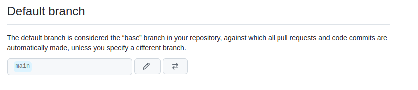

## Фронт для программы поиска работы

main - основная ветка


### Тестирование

````shell
yarn test
````

### Локальный запуск

````shell
yarn start
````

### Сборка для размещения на web сервере

````shell
yarn build-prod
````
см. package.json:

````shell
...
  "scripts": {
    ...
    "build-prod": "PUBLIC_URL=/vacancy/ react-scripts build",
...
}
````

__PUBLIC_URL=/vacancy/__ в package.json указывает по какому пути приложение будет доступно на web-сервере

Собранный проект будет в build/ :

````shell
yarn run v1.22.5
$ react-scripts build
Creating an optimized production build...
Compiled successfully.

File sizes after gzip:
/sorry/index.html
  55.71 KB         build/static/js/2.924064c7.chunk.js
  22.69 KB         build/static/css/2.7f1403ef.chunk.css
  1.57 KB (-21 B)  build/static/js/main.ba052924.chunk.js
  1.36 KB          build/static/js/3.8289d0eb.chunk.js
  1.13 KB          build/static/js/runtime~main.fb67d27a.js
  750 B (+58 B)    build/static/css/main.2a690229.chunk.css

````

Содержимое build/ скопировать на сервер v.perm.ru в папку /var/www/vacancy/

Доступ к приложению: http://v.perm.ru/vacancy/index.html

Этот проект сделан на основе простого проекта с React/Redux/Bootstrap [https://github.com/cherepakhin/redux-simple-app](https://github.com/cherepakhin/redux-simple-app). В нем же описание деталей работы с React/Redux и рабочие заметки (подглядывать в историю git).


### Заметки о css

Изменение правого отступа div элемента c id=list-group-item-actions-right (App.css):

````shell
.list-group-item-actions-last {
  right: 11px;
}
````

Tooltip:

Содержание подсказки (tooltip) определяется  в поле _title_:

````shell
<div id="idDeleteBtn" className="col-1 list-group-item-actions list-group-item-actions-last" title="Удалить вакансию">
````

Ошибка "digital envelope routines::unsupported"

Ответ:

[https://paolochang.github.io/posts/bugfix-digital_envelope_routines_unsupported/](https://paolochang.github.io/posts/bugfix-digital_envelope_routines_unsupported/)

If you encounter the “digital envelope routines::unsupported” error, you may be tempting to use the following easiest solutions:

Downgrade Node.js to pre v17 
OR
Use the legacy SSL provider:

````json
{
  "scripts": {
    "start": "react-scripts --openssl-legacy-provider start"
  }
}
````

Использован 2 вариант.

#### Последняя колонка

Последняя колонка либо вылазит за пределы таблицы, либо после нее остается много пустого места. Для решения этого, в дополнении к атрибуту обычной колонки __list-group-item-action__, сделано свойство __list-group-item-action-last__  и добавлен аттрибут __!important;__.

````
    <div id="idMoreBtn" className="col-1 list-group-item-action" title="Подробнее о вакансии">
      <span onClick={() => openMoreDlg(id)} tabIndex={0} role="button">Подробнее</span>
    </div>
    <div id="idDeleteBtn" className="col-1 list-group-item-action list-group-item-action-last" title="Удалить вакансию">
      <span onClick={() => openDeleteConfirmDlg(id)} tabIndex={-1} role="button">Удалить</span>
    </div>
````

css:
````    
.list-group-item-action {
  text-align: center;
  padding-right: 1ch;
  padding-left: 1ch;

  clear: both;
  height: 1px;
  float:left;

  min-width: 12ch;
}

.list-group-item-action-last {
  right: 1ch;
  min-width: 7ch;
  max-width: 7ch !important;
}
    
````

#### Установка ширины элементов в "колонках"

В Bootstrap сетка состоит из 12 "колонок". В примерах ниже элементам выделяется 1 колонка. В зависимости от размера окна ширина колонки меняется.   

````
<Button className="... col-1">...</Button>
````

Пример в App.js (col-1): 

````    
<Col xs={12} className="mt-2 mb-2">
  <Button className="ml-0 pl-1 pr-1 col-1">Все</Button>
  <Button className="ml-1 pl-1 pr-1 col-1">Текущие</Button>
  <Button className="ml-1 pl-1 pr-1 col-1">Новая</Button>
</Col>
````    

#### Hover

В обычном состоянии скрыть (__display: none;__):

````json
.list-group-item-action span {
  display: none;
  color: #c00;
}

````

При наведении курсора (__.list-group-item:hover__):
 - показать (__display: inline;__);
 - изменить курсор (__cursor: pointer;__)
 - подчеркнуть (__text-decoration: underline;__)

````json
.main-app-container .list-group-item:hover .list-group-item-action span {
  display: inline;
  cursor: pointer;
}

.list-group-item-action span:hover {
  text-decoration: underline;
}

````

В мобилах курсора нет, поэтому показывать всегда.

#### Отступы

[https://learn.javascript.ru/css-units#otnositelno-shrifta-em](https://learn.javascript.ru/css-units#otnositelno-shrifta-em)

Относительно шрифта: em.
1em – __текущий размер шрифта__.
Можно брать любые пропорции от текущего шрифта: 2em, 0.5em и т.п.
Размеры в em – относительные, они определяются по текущему контексту.

#### О тестировании

Элемент:

````html
<h4 id="label_list_vacancies">Список вакансий</h4>
````
Тест текста:

````java
it("Check content", () => {
  const wrapper = mount(<App />);
  const label = wrapper.find("#label_list_vacancies").text();
  expect(label).toEqual("Список вакансий");
});
````

Комментарии вида {/*TODO...*/} в компонентах помещаются в выходной html при render() и учитываются при тестировании. Н.п. смещается индекс children.

#### Проблемы

При тестировании через __renderer__:

````java
const tree = renderer.create(<DeleteConfirmDlg {...vacancy} />);
    console.log(tree);
    expect(tree).toMatchSnapshot();
````
Возникает ошибка:

````text
    TypeError: parentInstance.children.indexOf is not a function

      168 |     };
      169 |
    > 170 |     const tree = renderer.create(<DeleteConfirmDlg {...vacancy} />);
          |                           ^
      171 |     console.log(tree);
      172 |     expect(tree).toMatchSnapshot();
      173 |   });
````

Описано в [https://stackforgeeks.com/blog/uncaught-typeerror-aindexof-is-not-a-function-error-when-opening-new-foundation-project](https://stackforgeeks.com/blog/uncaught-typeerror-aindexof-is-not-a-function-error-when-opening-new-foundation-project)

Решение:

Использовать "enzyme-to-json" вместо "react-test-renderer".

````java
import toJson from "enzyme-to-json";
import { shallow, mount } from "enzyme";
import renderer from 'react-test-renderer';

    ...
    const wrapper = shallow(<DeleteConfirmDlg {...vacancy} />);
    const dlg = toJson(wrapper);
    ...

````

[Пример snapshot](https://github.com/cherepakhin/vacancy_front/blob/add_fetch/doc/DeleteConfirmDlg.spec.js.snap)

Локальные snapshots помещаются в подкаталог __snapshots__ [src/components/vacancies/__snapshots__/DeleteConfirmDlg.spec.js.snap](src/components/vacancies/__snapshots__/DeleteConfirmDlg.spec.js.snap)

пример теста:

````java
    const wrapper = mount(<DeleteConfirmDlg {...vacancy} />);

    expect(EnzymeToJson(wrapper)).toMatchSnapshot();

````

#### Ссылки

- [Диаграмма состояний](https://app.diagrams.net/?src=about#G1i8cVXJXj7xbnOIqtzitvihxvn_yiwOuJ#%7B%22pageId%22%3A%226vxvHjby1d88luMmcxHr%22%7D)<br/>
- [Ошибка /lib/x86_64-linux-gnu/libc.so.6: version `GLIBC_2.28' not found](http://v.perm.ru/main/index.php/75-oshibka-lib-x86-64-linux-gnu-libc-so-6-version-glibc-2-28-not-found)

#### TODO

- Jest
- soFetch
- Добавить диалог "Добавить событие" к вакансии. Будут 2 даты: дата создания и дата последнего события.
- Добавить сортировку по Дате, Приоритету, Дате последнего события. 
- "Подробнее" показывать на полном экране. Много деталей, пространства МОДАЛЬНОГО ДИАЛОГА не хватает.
- Про размещение на мобиле забить, т.к. требуется совсем другая компоновка. Для мобилы делать СОВСЕМ отдельный интерфейс. 
- Camunda
- JasperReports
- jXls